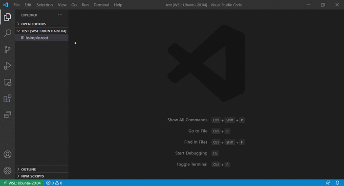

# ROOT File Viewer

ROOT File Viewer allows you to see your ROOT Files directly in VS Code! This extension is for you if you want to see ROOT Files:

- with just a click, without having to type anything on a terminal
- anywhere, with no local ROOT installation required

